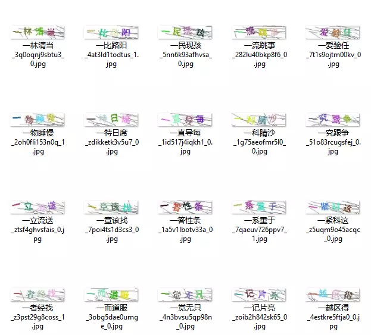
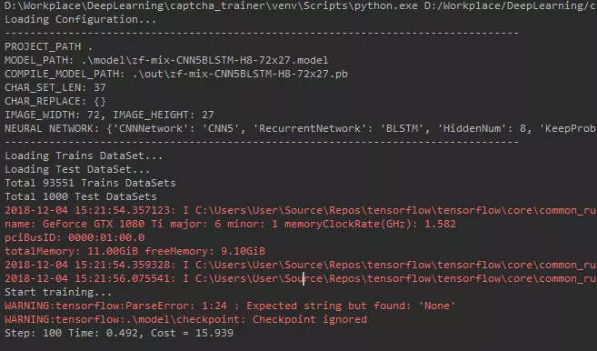
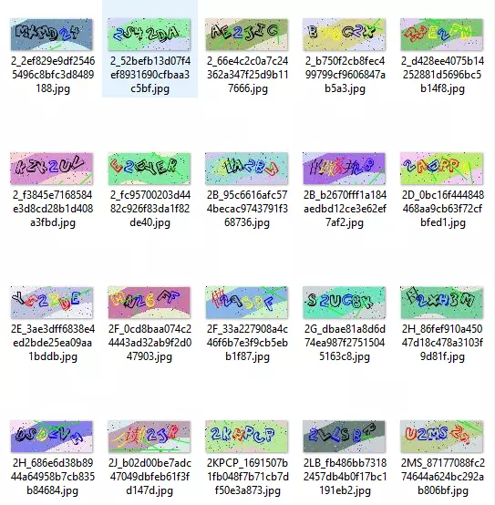
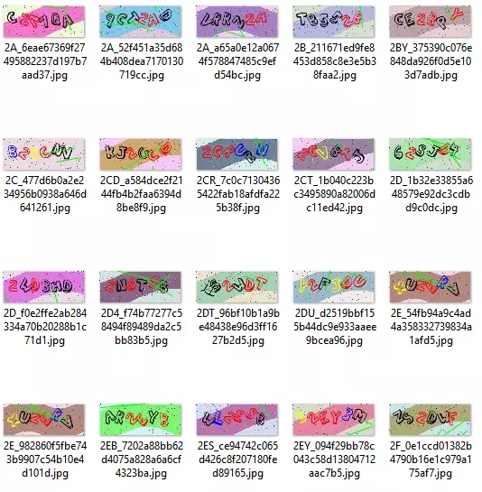

# CNN+BLSTM+CTC的验证码识别从训练到部署

<h2>一 前言</h2>
<p><span style="color: rgb(0, 176, 80);"><b>长话短说，开门见山，验证码是网络安全的一个重要组成部分，提高了暴力尝试破解的成本，而验证码识别是其反面，本文将带领大家看看如何使用深度学习进行验证码的识别，各厂可以通过本文来认识图形验证码的弱点和不可靠性。</b></span></p>
<p><strong>最新更新（2019/01/21）</strong>：如果对于DLL调用感兴趣或是其他语言的TensorFlow API感兴趣的移步以下两个项目：</p>
<blockquote><p><a href="https://github.com/kerlomz/captcha_library_c">https://github.com/kerlomz/captcha_library_c</a></p>
<p><a href="https://github.com/kerlomz/captcha_demo_csharp">https://github.com/kerlomz/captcha_demo_csharp</a></p>
</blockquote>
<p>笔者选用的时下最为流行的CNN+BLSTM+CTC进行端到端的不定长验证码识别，代码中预留了DenseNet+BLSTM+CTC的选项，可以在配置中直接选用。首先，介绍个大概吧。</p>
<table>
<colgroup>
<col width="24%">
<col width="25%">
<col width="25%">
<col width="25%">    </colgroup>
<thead>
<tr>
<th>网格结构</th>
<th>predict-CPU</th>
<th>predict-GPU</th>
<th>模型大小</th>
</tr>
</thead>
<tbody>
<tr>
<td>CNN5+Bi-LSTM+H64+CTC</td>
<td>15ms</td>
<td>28ms</td>
<td>2mb</td>
</tr>
<tr>
<td>CNN5+Bi-LSTM+H16+CTC</td>
<td>8ms</td>
<td>28ms</td>
<td>1.5mb</td>
</tr>
<tr>
<td>DenseNet+Bi-LSTM+H64+CTC</td>
<td>60ms</td>
<td>60ms</td>
<td>6.5mb</td>
</tr>
</tbody>
</table>
<p>H16/H64指的是Bi-LSTM的隐藏神经元个数num_units，这里注意，你没有看错，也没有写反，LSTM有时序依赖，tf.contrib.rnn.LSTMCell的实现没能很充分的利用GPU的计算资源，底层kernel函数之间的间隙非常大，不利于充分的利用 GPU 的并行性来进行计算。所以本项目使用GPU训练，使用CPU进行预测。预测服务部署项目源码请移步此处：<strong><a href="https://github.com/kerlomz/captcha_platform">https://github.com/kerlomz/captcha_platform</a></strong></p>
<h2>二 环境依赖：</h2>
<p>关于CUDA和cuDNN版本的问题，不少人很纠结，这里就列出官方通过pip安装的TensorFlow的版本对应表：</p>
<h3>Linux</h3>
<table>
<colgroup>
<col width="16%">
<col width="16%">
<col width="16%">
<col width="16%">
<col width="16%">
<col width="17%">    </colgroup>
<thead>
<tr>
<th>Version</th>
<th>Python version</th>
<th>Compiler</th>
<th>Build tools</th>
<th>cuDNN</th>
<th>CUDA</th>
</tr>
</thead>
<tbody>
<tr>
<td>tensorflow_gpu-1.12.0</td>
<td>2.7, 3.3-3.6</td>
<td>GCC 4.8</td>
<td>Bazel 0.15.0</td>
<td>7</td>
<td>9</td>
</tr>
<tr>
<td>tensorflow_gpu-1.11.0</td>
<td>2.7, 3.3-3.6</td>
<td>GCC 4.8</td>
<td>Bazel 0.15.0</td>
<td>7</td>
<td>9</td>
</tr>
<tr>
<td>tensorflow_gpu-1.10.0</td>
<td>2.7, 3.3-3.6</td>
<td>GCC 4.8</td>
<td>Bazel 0.15.0</td>
<td>7</td>
<td>9</td>
</tr>
<tr>
<td>tensorflow_gpu-1.9.0</td>
<td>2.7, 3.3-3.6</td>
<td>GCC 4.8</td>
<td>Bazel 0.11.0</td>
<td>7</td>
<td>9</td>
</tr>
<tr>
<td>tensorflow_gpu-1.8.0</td>
<td>2.7, 3.3-3.6</td>
<td>GCC 4.8</td>
<td>Bazel 0.10.0</td>
<td>7</td>
<td>9</td>
</tr>
<tr>
<td>tensorflow_gpu-1.7.0</td>
<td>2.7, 3.3-3.6</td>
<td>GCC 4.8</td>
<td>Bazel 0.9.0</td>
<td>7</td>
<td>9</td>
</tr>
<tr>
<td>tensorflow_gpu-1.6.0</td>
<td>2.7, 3.3-3.6</td>
<td>GCC 4.8</td>
<td>Bazel 0.9.0</td>
<td>7</td>
<td>9</td>
</tr>
</tbody>
</table>
<h3>Windows</h3>
<table>
<colgroup>
<col width="16%">
<col width="16%">
<col width="16%">
<col width="16%">
<col width="16%">
<col width="17%">    </colgroup>
<thead>
<tr>
<th>Version</th>
<th>Python version</th>
<th>Compiler</th>
<th>Build tools</th>
<th>cuDNN</th>
<th>CUDA</th>
</tr>
</thead>
<tbody>
<tr>
<td>tensorflow_gpu-1.12.0</td>
<td>3.5-3.6</td>
<td>MSVC 2015 update 3</td>
<td>Bazel 0.15.0</td>
<td>7</td>
<td>9</td>
</tr>
<tr>
<td>tensorflow_gpu-1.11.0</td>
<td>3.5-3.6</td>
<td>MSVC 2015 update 3</td>
<td>Bazel 0.15.0</td>
<td>7</td>
<td>9</td>
</tr>
<tr>
<td>tensorflow_gpu-1.10.0</td>
<td>3.5-3.6</td>
<td>MSVC 2015 update 3</td>
<td>Cmake v3.6.3</td>
<td>7</td>
<td>9</td>
</tr>
<tr>
<td>tensorflow_gpu-1.9.0</td>
<td>3.5-3.6</td>
<td>MSVC 2015 update 3</td>
<td>Cmake v3.6.3</td>
<td>7</td>
<td>9</td>
</tr>
<tr>
<td>tensorflow_gpu-1.8.0</td>
<td>3.5-3.6</td>
<td>MSVC 2015 update 3</td>
<td>Cmake v3.6.3</td>
<td>7</td>
<td>9</td>
</tr>
<tr>
<td>tensorflow_gpu-1.7.0</td>
<td>3.5-3.6</td>
<td>MSVC 2015 update 3</td>
<td>Cmake v3.6.3</td>
<td>7</td>
<td>9</td>
</tr>
<tr>
<td>tensorflow_gpu-1.6.0</td>
<td>3.5-3.6</td>
<td>MSVC 2015 update 3</td>
<td>Cmake v3.6.3</td>
<td>7</td>
<td>9</td>
</tr>
</tbody>
</table>
<p>如果希望使用上面对应之外的搭配的CUDA和cuDNN，可以自行编译TensorFlow，或者去Github上搜索<code>TensorFlow Wheel</code>找到第三方编译的对应版本的whl安装包。提前预警，若是自己编译将会苦难重重，坑很多，这里就不展开了。</p>
<h3>2.1 本项目环境依赖</h3>
<p><strong>目前在以下主流操作系统平台均测试通过：</strong></p>
<table>
<thead>
<tr>
<th>操作系统</th>
<th>最低支持版本</th>
</tr>
</thead>
<tbody>
<tr>
<td>Ubuntu</td>
<td>16.04</td>
</tr>
<tr>
<td>Windows</td>
<td>7 SP1</td>
</tr>
<tr>
<td>MacOS</td>
<td>N/A</td>
</tr>
</tbody>
</table>
<p><strong>本训练项目主要的环境依赖清单如下</strong></p>
<table>
<thead>
<tr>
<th>依赖</th>
<th>最低支持版本</th>
</tr>
</thead>
<tbody>
<tr>
<td>Python</td>
<td>3.6</td>
</tr>
<tr>
<td>TensorFlow-GPU</td>
<td>1.6.0</td>
</tr>
<tr>
<td>Opencv-Python</td>
<td>3.3.0.10</td>
</tr>
<tr>
<td>Numpy</td>
<td>1.14.1</td>
</tr>
<tr>
<td>Pillow</td>
<td>4.3.0</td>
</tr>
<tr>
<td>PyYaml</td>
<td>3.13</td>
</tr>
</tbody>
</table>
<h4>2.1.1 Ubuntu 16.04 下的 Python 3.6</h4>
<p><strong>1）先安装Python环境</strong></p>
<pre><code class="bash">sudo apt-get install openssl  
sudo apt-get install libssl-dev
sudo apt-get install libc6-dev gcc  
sudo apt-get install -y make build-essential zlib1g-dev libbz2-dev libreadline-dev $ libsqlite3-dev wget curl llvm tk-dev 
wget https://www.python.org/ftp/python/3.6.6/Python-3.6.6.tgz
tar -vxf Python-3.6.6.tar.xz
cd Python-3.6.6
./configure --prefix=/usr/local  --enable-shared
make -j8
sudo make install -j8
</code></pre>
<p>经过上面指令就安装好Python3.6环境了，如果提示找不到<code>libpython3.6m.so.1.0</code>就到/usr/local/lib路径下将该文件复制一份到/usr/lib和/usr/lib64路径下。<br>
<strong>2）安装相关依赖（这一步Windows和Linux通用）</strong><br>
可以直接在项目路径下执行<code>pip3 install -r requirements.txt</code>安装所有依赖，注意这一步是安装在全局Python环境下的，强烈建议使用虚拟环境进行项目间的环境隔离，如<strong>Virtualenv</strong>或<strong>Anaconda</strong>等等。<br>
我一般使用的是Virtualenv，有修改代码需要的，建议安装PyCharm作为Python IDE</p>
<pre><code class="bash">virtualenv -p /usr/bin/python3 venv # venv is the name of the virtual environment.
cd venv/ # venv is the name of the virtual environment.
source bin/activate # to activate the current virtual environment.
cd captcha_trainer # captcha_trainer is the project path.
pip3 install -r requirements.txt
</code></pre>
<h4>2.1.2 Ubuntu 16.04 下的 CUDA/cuDNN</h4>
<p>网上看到过很多教程，我自己也部署过很多次，Ubuntu 16.04遇到的坑还是比较少的。14.04支持就没那么好，如果主板不支持关闭SecureBoot的话千万不要安装Desktop版，因为安装好之后一定会无限循环在登陆界面无法进入桌面。<br>
网上教程说要加驱动黑名单什么的我直接跳过了，亲测没那个必要。就简单的几步：<br>
<strong>1. 下载好安装包</strong><br>
注意下载runfile类型的安装包，deb安装会自动安装默认驱动，极有可能导致登陆循环<br>
NVIDIA 驱动下载：<a href="https://links.jianshu.com/go?to=https%3A%2F%2Fwww.geforce.cn%2Fdrivers" target="_blank">https://www.geforce.cn/drivers</a><br>
CUDA 下载地址：<a href="https://links.jianshu.com/go?to=https%3A%2F%2Fdeveloper.nvidia.com%2Fcuda-downloads" target="_blank">https://developer.nvidia.com/cuda-downloads</a><br>
cuDNN 下载地址：<a href="https://links.jianshu.com/go?to=https%3A%2F%2Fdeveloper.nvidia.com%2Fcudnn" target="_blank">https://developer.nvidia.com/cudnn</a> （需要注册NVIDIA账号且登陆，下载deb安装包）</p>
<p><strong>2. 关闭图形界面</strong><br>
Ctrl+alt+F1进入字符界面，关闭图形界面</p>
<pre><code>sudo service lightdm stop
</code></pre>
<p><strong>3. 安装Nvidia Driver</strong></p>
<p>命令中的版本自己对应下载的版本改，在上面的下载地址根据自己的显卡型号下载最新版，切记是runfile格式的安装包。</p>
<pre><code>sudo chmod a+x NVIDIA-Linux-x86_64-384.90.run //获取执行权限
sudo ./NVIDIA-Linux-x86_64-384.90.run –no-x-check –no-nouveau-check –no-opengl-files //安装驱动
</code></pre>
<p>安装成功以后使用以下命令验证，如果显示显卡信息则表示安装成功</p>
<pre><code class="bash">nvidia-smi
</code></pre>
<p><strong>4. 安装CUDA</strong></p>
<p>1）先安装一些系统依赖库</p>
<pre><code>sudo apt-get install freeglut3-dev build-essential libx11-dev libxmu-dev libxi-dev libgl1-mesa-glx libglu1-mesa libglu1-mesa-dev
</code></pre>
<ol start="2">
<li>执行安装程序，按指示无脑继续就好了，<strong>如果提示是否安装驱动选不安装。</strong>
</li>
</ol>
<pre><code>sudo sh cuda_9.0.176_384.81_linux.run
</code></pre>
<p>安装完如果环境变量没配上去，就写到 ~/.bashrc 文件的尾部</p>
<pre><code>export PATH=/usr/local/cuda-9.0/bin${PATH:+:${PATH}}
export LD_LIBRARY_PATH=/usr/local/cuda-9.0/lib64${LD_LIBRARY_PATH:+:${LD_LIBRARY_PATH}}
</code></pre>
<p>然后在终端执行 <code>sudo ldconfig</code>更新，安装完毕就可以重启机器重启图形界面了。</p>
<pre><code>sudo service lightdm start
</code></pre>
<h4>2.1.3 Windows 系统</h4>
<p>在Windows其实简单很多，只要到官网下载安装包无脑安装就可以了，下载连接同Ubuntu，先安装Python，显卡驱动，CUDA，然后下载对应的cuDNN替换到对应路径即可。</p>
<p><strong>花了超长篇幅介绍了训练环境的基本搭建，主要是给尚未入门的读者看的，老鸟们随便跳过</strong></p>
<h2>3 使用</h2>
<p>入手的第一步环境搭建好了，那就是准备跑代码了，还是有几个必要的条件，巧妇难为无米之炊，首先，既然是训练，要先有训练集，有一个新手尝鲜的训练集，是mnist手写识别的例子，可以在腾讯云下载：<a href="https://links.jianshu.com/go?to=https%3A%2F%2Fshare.weiyun.com%2F5pzGF4V" target="_blank">https://share.weiyun.com/5pzGF4V</a>，现在万事俱备，只欠东风。</p>
<h3>3.1 定义一个模型</h3>
<p>本项目采用的是参数化配置，不需要改动任何代码，可以训练几乎任何字符型图片验证码，下面从两个配置文件说起：<br>
<code>config.yaml # 系统配置</code></p>

```yaml
# - requirement.txt  -  GPU: tensorflow-gpu, CPU: tensorflow
# - If you use the GPU version, you need to install some additional applications.
# TrainRegex and TestRegex: Default matching apple_20181010121212.jpg file.
# - The Default is .*?(?=_.*\.)
# TrainsPath and TestPath: The local absolute path of your training and testing set.
# TestSetNum: This is an optional parameter that is used when you want to extract some of the test set
# - from the training set when you are not preparing the test set separately.
System:
  DeviceUsage: 0.7
  TrainsPath: 'E:\Task\Trains\YourModelName\'
  TrainRegex: '.*?(?=_)'
  TestPath: 'E:\Task\TestGroup\YourModelName\'
  TestRegex: '.*?(?=_)'
  TestSetNum: 1000

# CNNNetwork: [CNN5, DenseNet]
# RecurrentNetwork: [BLSTM, LSTM]
# - The recommended configuration is CNN5+BLSTM / DenseNet+BLSTM
# HiddenNum: [64, 128, 256]
# - This parameter indicates the number of nodes used to remember and store past states.
NeuralNet:
  CNNNetwork: CNN5
  RecurrentNetwork: BLSTM
  HiddenNum: 64
  KeepProb: 0.98

# SavedSteps: A Session.run() execution is called a Steps,
# - Used to save training progress, Default value is 100.
# ValidationSteps: Used to calculate accuracy, Default value is 100.
# TestNum: The number of samples for each test batch.
# - A test for every saved steps.
# EndAcc: Finish the training when the accuracy reaches [EndAcc*100]%.
# EndEpochs: Finish the training when the epoch is greater than the defined epoch.
Trains:
  SavedSteps: 100
  ValidationSteps: 500
  EndAcc: 0.975
  EndEpochs: 1
  BatchSize: 64
  TestBatchSize: 400
  LearningRate: 0.01
  DecayRate: 0.98
  DecaySteps: 10000
```

<p>上面看起来好多好多参数，其实大部分可以不用改动，你需要修改的仅仅是训练集路径就可以了，<strong>注意：如果训练集的命名格式和我提供的新手训练集不一样，请根据实际情况修改TrainRegex和TestRegex的正则表达式。</strong>，TrainsPath和TestPath路径支持list参数，允许多个路径，这种操作适用于需要将多种样本训练为一个模型，或者希望训练一套通用模型的人。为了加快训练速度，提高训练集读取效率，特别提供了make_dataset.py来支持将训练集打包为tfrecords格式输入，经过make_dataset.py打包之后的训练集将输出到本项目的dataset路径下，只需修改TrainsPath键的配置如下即可</p>
<pre><code class="yaml">TrainsPath: './dataset/xxx.tfrecords'
</code></pre>
<p>TestPath是允许为空的，如果TestPath为空将会使用TestSetNum参数自动划分出对应个数的测试集。如果使用自动划分机制，那么TestSetNum测试集总数参数必须大于等于TestBatchSize测试集每次读取的批次大小。<br>
神经网络这块可以讲一讲，默认提供的组合是CNN5(CNN5层模型)+BLSTM(Bidirectional LSTM)+CTC，亲测收敛最快，但是训练集过小，实际图片变化很大特征很多的情况下容易发生过拟合。DenseNet可以碰运气在样本量很小的情况下很好的训练出高精度的模型，为什么是碰运气呢，因为收敛快不快随机的初始权重很重要，运气好前500步可能对测试集就有40-60%准确率，运气不好2000步之后还是0，收敛快慢是有一定的运气成分的。</p>
<pre><code class="yaml">NeuralNet:
  CNNNetwork: CNN5
  RecurrentNetwork: BLSTM
  HiddenNum: 64
  KeepProb: 0.99
</code></pre>
<p>隐藏层HiddenNum笔者尝试过8~64，都能控制在很小的模型大小之内，如果想使用DenseNet代替CNN5直接修改如上配置中的CNNNetwork参数替换为：</p>
<pre><code class="yaml">NeuralNet:
  CNNNetwork: DenseNet
  ......
</code></pre>
<p><code>model.yaml # 模型配置</code></p>

```yaml
# ModelName: Corresponding to the model file in the model directory,
# - such as YourModelName.pb, fill in YourModelName here.
# CharSet: Provides a default optional built-in solution:
# - [ALPHANUMERIC, ALPHANUMERIC_LOWER, ALPHANUMERIC_UPPER,
# -- NUMERIC, ALPHABET_LOWER, ALPHABET_UPPER, ALPHABET]
# - Or you can use your own customized character set like: ['a', '1', '2'].
# CharExclude: CharExclude should be a list, like: ['a', '1', '2']
# - which is convenient for users to freely combine character sets.
# - If you don't want to manually define the character set manually,
# - you can choose a built-in character set
# - and set the characters to be excluded by CharExclude parameter.
Model:
  Sites: []
  ModelName: YourModelName-CNN5-H64-150x50
  ModelType: 150x50
  CharSet: ALPHANUMERIC_LOWER
  CharExclude: []
  CharReplace: {}
  ImageWidth: 150
  ImageHeight: 50

# Binaryzation: [-1: Off, >0 and < 255: On].
# Smoothing: [-1: Off, >0: On].
# Blur: [-1: Off, >0: On].
# Resize: [WIDTH, HEIGHT]  
# - If the image size is too small, the training effect will be poor and you need to zoom in.
# - ctc_loss error "No valid path found." happened
Pretreatment:
  Binaryzation: -1
  Smoothing: -1
  Blur: -1
```

<p>上述的配置只要关注<br>
ModelName、CharSet、ImageWidth、ImageHeight<br>
首先给模型取一个好名字是成功的第一步，字符集CharSet其实大多数情况下不需要修改，一般的图形验证码离不开数字和英文，而且一般来说是大小写不敏感的，不区分大小写，因为打码平台收集的训练集质量参差不齐，有些大写有些小写，不如全部统一为小写，默认ALPHANUMERIC_LOWER则会自动将大写的转为小写，字符集可定制化很灵活，除了配置备注上提供的几种类型，还可以训练中文，自定义字符集用list表示，示例如下：</p>
<pre><code>CharSet: ['常', '世', '宁', '慢', '南', '制', '根', '难']
</code></pre>
<p>可以自己根据收集训练集的实际字符集使用率来定义，也可以无脑网上找3500常用字来训练，<strong>注意：中文字符集一般比数字英文大很多，刚开始收敛比较慢，需要更久的训练时间，也需要更多的样本量，请量力而行</strong><br>
<div align="center"></div>
<strong>形如上图的图片能轻松训练到95%以上的识别率。</strong><br>
ImageWidth、ImageHeight只要和当前图片尺寸匹配即可，其实这里的配置主要是为了方便后面的部署智能策略。<br>
其他的如Pretreatment之下的参数是用来做图片预处理的，因为笔者致力于做一套通用模型，模型只使用了灰度做预处理。其中可选的二值化、均值滤波、高斯模糊均未开启，即使不进行那些预处理该框架已经能够达到很理想的识别效果了，笔者自用的大多数模型都是98%以上的识别率。<p></p>
<h3>3.2 开始训练</h3>
<p>按照上面的介绍，配置只要修改极少数的参数对应的值，就可以开启正式的训练之旅了，具体操作如下：<br>
可以直接使用PyCharm的Run，执行trains.py，也可以在激活Virtualenv下使用终端亦或在安装依赖的全局环境下执行</p>
<pre><code class="bash">python3 trains.py
</code></pre>
<p>剩下的就是等了，看过程，等结果。<br>
正常开始训练的模样应该是这样的：</p>
<div align="center"></div>
<p>训练结束会在项目的out路径下生成一个pb和yaml文件，下面该到部署环节了。</p>

<h3>3.3 部署</h3>
<p>真的很有必要认真的介绍一下部署项目，比起训练，这个部署项目倾注了笔者更多的心血，为什么呢？<br>
项目地址：<a href="https://links.jianshu.com/go?to=https%3A%2F%2Fgithub.com%2Fkerlomz%2Fcaptcha_platform" target="_blank">https://github.com/kerlomz/captcha_platform</a></p>
<h4>真的值得了解的几点</h4>
<ol>
<li>同时管理多个模型，支持模型热拔插</li>
<li>灵活的版本控制</li>
<li>支持批量识别</li>
<li>服务智能路由策略</li>
</ol>
<p><strong>首先笔者重写了Tensor Flow的Graph会话管理，设计会话池，允许同时管理多模型，实现多模型动态部署方案。</strong><br>
<strong>1）</strong>训练好的pb模型只要放在部署项目的graph路径下，yaml模型配置文件放在model，即可被服务发现并加载，<br>
<strong>2）</strong>如果需要卸载一个正在服务的模型，只需要在model中删除该模型的yaml配置文件，在graph中删除对应的pb模型即可。<br>
<strong>3）</strong>如果需要更新一个已经服务中的模型，只需修改新版的模型yaml配置文件的版本号高于原模型的版本号，按先放pb后放yaml的顺序，服务便会自动发现新版的模型并加载使用，旧的模型将因版本低于新版模型不会被调用，可以按照上述的卸载方法卸载已被弃用的模型释放内存。<br>
上面的操作中无需重启服务，完全的无缝切换</p>
<p>其次，一套服务想要服务于各式各样的图像识别需求，可以定义一套策略，训练时将所有尺寸一样的图片训练成一个模型，服务根据图片尺寸自动选择使用哪个模型，这样的设计使定制化和通用性共存，等积累到一定多样的训练集时可以将所有的训练集合到一起训练一个通用模型，亦可以彼此独立，每个模型的叠加仅仅增加了少量的内存或显存，网上的方案大多是不同的模型单独部署一套服务，每个进程加载了一整套TensorFlow框架势必是过于庞大和多余的。</p>
<p>用到批量识别需求的人相对少很多这里就不展开介绍了。识别项目提供了多套可选的服务有：gRPC，Flask，Tornado，Sanic，其中Flask和Tornado提供了加密接口，类似于微信公众号开发接口的SecretKey和AccessKey接口，感兴趣的可以在demo.py中阅读调用源码了解。</p>
<p>部署的使用可以经过package.py编译为可执行文件，这样可以免去更换机器环境安装的烦恼，部署项目安装流程同训练项目，项目中提供的requirements.txt已经将所需的依赖都列清楚了，强烈建议部署项目安装cpu版TensorFlow。</p>
<p><strong>Linux：</strong></p>
<ol>
<li>Tornado：</li>
</ol>
<pre><code class="bash"># 端口 19952
python3 tornado_server.py
</code></pre>
<ol start="2">
<li>Flask</li>
</ol>
<pre><code class="bash"># 方案1，裸启动， 端口 19951
python flask_server.py 
# 方案2，使用gunicorn，端口 5000
pip install gunicorn 
gunicorn -c deploy.conf.py flask_server:app
</code></pre>
<ol start="3">
<li>Sanic：</li>
</ol>
<pre><code class="bash"># 端口 19953
python3 sanic_server.py
</code></pre>
<ol start="4">
<li>gRPC:</li>
</ol>
<pre><code class="bash"># 端口 50054
python3 grpc_server.py
</code></pre>
<p><strong>Windows：</strong><br>
Windows平台下都是通过<code>python3 xxx_server.py</code>启动对应的服务，注意，Tornado、Flask、Sanic的性能在Windows平台都大打折扣，gRPC是Google开源的RPC服务，有较为优越的性能。</p>
<h3>3.4 调用/测试</h3>
<p><strong>1. Flask服务：</strong></p>
<table>
<thead>
<tr>
<th>请求地址</th>
<th>Content-Type</th>
<th>参数形式</th>
<th>请求方法</th>
</tr>
</thead>
<tbody>
<tr>
<td><a href="https://links.jianshu.com/go?to=http%3A%2F%2Flocalhost%3A19951%2Fcaptcha%2Fv1" target="_blank">http://localhost:19951/captcha/v1</a></td>
<td>application/json</td>
<td>JSON</td>
<td>POST</td>
</tr>
</tbody>
</table>
<p><strong>具体参数：</strong></p>
<table>
<thead>
<tr>
<th>参数名</th>
<th>必选</th>
<th>类型</th>
<th>说明</th>
</tr>
</thead>
<tbody>
<tr>
<td>image</td>
<td>Yes</td>
<td>String</td>
<td>Base64 编码</td>
</tr>
<tr>
<td>model_site</td>
<td>No</td>
<td>String</td>
<td>网站名，yaml配置中可绑定</td>
</tr>
<tr>
<td>model_type</td>
<td>No</td>
<td>String</td>
<td>类别，yaml配置中可绑定</td>
</tr>
</tbody>
</table>
<p>请求为JSON格式，形如：{"image": "base64编码后的图像二进制流"}</p>
<p><strong>返回结果：</strong></p>
<table>
<thead>
<tr>
<th>参数名</th>
<th>类型</th>
<th>说明</th>
</tr>
</thead>
<tbody>
<tr>
<td>message</td>
<td>String</td>
<td>识别结果或错误消息</td>
</tr>
<tr>
<td>code</td>
<td>String</td>
<td>状态码</td>
</tr>
<tr>
<td>success</td>
<td>String</td>
<td>是否请求成功</td>
</tr>
</tbody>
</table>
<p>该返回为JSON格式，形如：{"message": "xxxx", "code": 0, "success": true}</p>
<p><strong>2. Tornado服务：</strong></p>
<table>
<thead>
<tr>
<th>请求地址</th>
<th>Content-Type</th>
<th>参数形式</th>
<th>请求方法</th>
</tr>
</thead>
<tbody>
<tr>
<td><a href="https://links.jianshu.com/go?to=http%3A%2F%2Flocalhost%3A19952%2Fcaptcha%2Fv1" target="_blank">http://localhost:19952/captcha/v1</a></td>
<td>application/json</td>
<td>JSON</td>
<td>POST</td>
</tr>
</tbody>
</table>
<p><strong>请求参数和返回格式同上</strong></p>
<p><strong>3. Sanic服务：</strong></p>
<table>
<thead>
<tr>
<th>请求地址</th>
<th>Content-Type</th>
<th>参数形式</th>
<th>请求方法</th>
</tr>
</thead>
<tbody>
<tr>
<td><a href="https://links.jianshu.com/go?to=http%3A%2F%2Flocalhost%3A19953%2Fcaptcha%2Fv1" target="_blank">http://localhost:19953/captcha/v1</a></td>
<td>application/json</td>
<td>JSON</td>
<td>POST</td>
</tr>
</tbody>
</table>
<p><strong>请求参数和返回格式同上</strong></p>
<p><strong>4. gRPC服务：</strong><br>
需要安装依赖，grpcio、grpcio_tools和对应的grpc.proto文件，可以直接从项目中的示例代码demo.py中提取。</p>
<pre><code class="python">class GoogleRPC(object):

    def __init__(self, host: str):
        self._url = '{}:50054'.format(host)
        self.true_count = 0
        self.total_count = 0

    def request(self, image, model_type=None, model_site=None):

        import grpc
        import grpc_pb2
        import grpc_pb2_grpc
        channel = grpc.insecure_channel(self._url)
        stub = grpc_pb2_grpc.PredictStub(channel)
        response = stub.predict(grpc_pb2.PredictRequest(
            image=image, split_char=',', model_type=model_type, model_site=model_site
        ))
        return {"message": response.result, "code": response.code, "success": response.success}

if __name__ == '__main__':
    result = GoogleRPC().request("base64编码后的图片二进制流")
    print(result)
</code></pre>
<h3>3.5 奇技淫巧</h3>
<p>该项目还可以直接用于识别带颜色的图片，本质是不同的颜色分别训练，调用的时候通过传参区分，如果希望获得图片中红色的文字，就直接通过参数定位到训练红色的模型，希望获取图片中蓝色的图片就通过参数定位到蓝色模型，如：</p>
<br>
<div align="center"></div>
<div align="center"></div>
<p>不过这种操作对样本量要求较高，且效率不高，当颜色参数越来越多时就不适用，可以采用颜色提取的方式，这样所需要的样本量将大大减少，但对于颜色提取算法效果要求高了。还有一种方案是同时预测验证码和每个字符对应的颜色，不过这需要修改现有的神经网络进行支持，在最后一层修改为双输出，一个输出颜色，一个输出对应字符，这对于样本标注的要求较高，也提高的成本，所以如果能用无限生成样本，那问题就迎刃而解了，比如上图，笔者就写了样本生成代码，感兴趣的可以移步：<br>
<a href="https://www.jianshu.com/p/da1b972e24f2" target="_blank">https://www.jianshu.com/p/da1b972e24f2</a><br>
其实还有很多很多技巧，例如，用生成的样本代替训练集，其实网上的图片验证码大多是采用开源的，稍作修改而已，大多数情况都能被近似生成出来，上述展示的验证码图片不代表任何实际的网站，如有雷同，纯属巧合，该项目只能用于学习和交流用途，不得用于非法用途。</p>
<h3>后记</h3>
<p>如果文章描述不够详尽或需要技术支持的，可以加群857149419咨询，或在开源项目中提issue，很荣幸能为开源社区贡献绵薄之力。</p>
<h3>关于版权</h3>
<blockquote>
<p>您同意，您向FreeBuf投稿、上传并获得稿酬的文章，网络信息传播权（包括但不限于转载权）、复制权、发行权、出租权、改编权、汇编权、翻译权等著作权的其他财产权利将属于FreeBuf；许可使用的权利类型为著作权的专有使用权；范围：中国大陆及港澳台、美国、欧洲；期限：三年；稿酬标准及支付方式：以FreeBuf向您通知的电子信息中稿酬金额为准，通过银行转账、支付宝、微信或其他电子支付方式。特别注意：除了上述您授权给Freebuf 之外的著作权财产权利，您仍然享有发表权、署名权、修改权、保护作品完整权。</p>
</blockquote>
<p>不是很懂这些，那就附上FreeBuf文章链接：<a href="https://links.jianshu.com/go?to=https%3A%2F%2Fwww.freebuf.com%2Farticles%2Fweb%2F195469.html" target="_blank">https://www.freebuf.com/articles/web/195469.html</a>，FreeBuf真的是一个流量很大的网站我都惊呆了，以后可能要换地方写文章了，简书刷文章大多数是推给我各种广告的，我也是服了，干货很少，一进去就是醒目的加群加QQ获取几百套PDF教程。</p>

## 原文链接
* https://www.jianshu.com/p/80ef04b16efc
* https://www.freebuf.com/articles/web/195469.html
